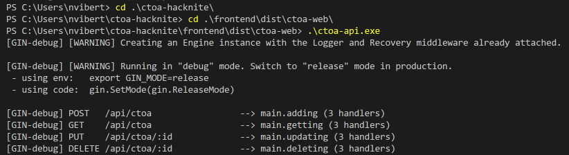
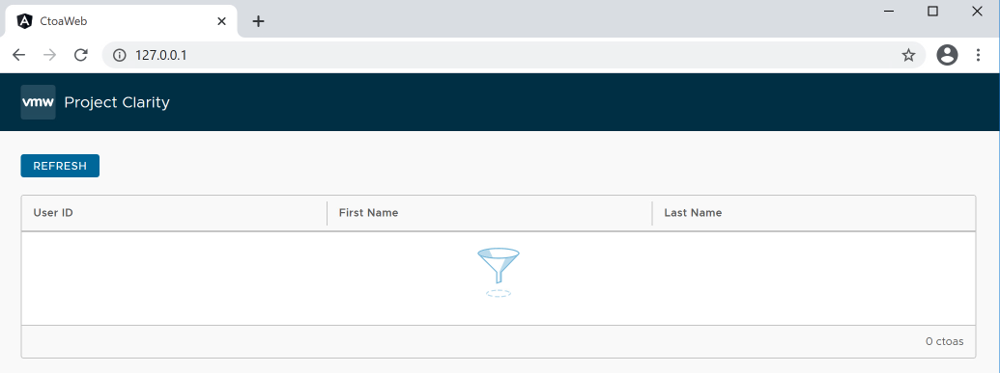
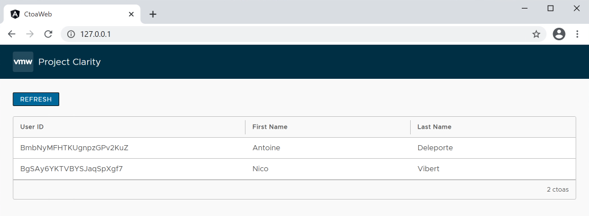

# terraform-build-windows

Instructions and an example of how to build a custom Terraform provider in Windows. Comes with instructions to install a sample web application that Terraform will interact with.

I started writing this as it's sometimes confusing to work out how to compile a Terraform provider in Windows and in which folder to run it.
It's even more confusing when you spend most of your time on a Mac: these instructions are mostly about helping others who run into this challenge.

The walk-through process below will let you compile a custom Terraform provider and interact with a sample web application. 

The provider and application were built by the awesome [Antoine](https://github.com/adeleporte/).

## Assumptions and Format

The format used below assumes your provider is leveraging the following syntax.

Obviously if you want to use your build your own custom Terraform provider, you can replace "vmware.com", "edu" and "ctoa" as per your preference.

For more details, check out the details on the HashiCorp [website](https://www.terraform.io/docs/language/providers/requirements.html).

```hcl
terraform {
  required_providers {
    ctoa = {
      source  = "vmware.com/edu/ctoa"
    }
  }
}
```

## Requirements:

- Git.
- Terraform.
- Go. 

## Usage:

### 1. Cloning the repo: ###
From the Windows command terminal:

Clone the following [repo](https://github.com/adeleporte/ctoa-hacknite.git) with the following command:  
`git clone https://github.com/adeleporte/ctoa-hacknite.git`


Navigate to the Terraform folder:  

`cd ctoa-hacknite\terraform-provider-ctoa`

Create a folder where the compiled provider will be moved to.

 - In a Windows cmd prompt:

`mkdir %APPDATA%\terraform.d\plugins\vmware.com\edu\ctoa\0.1\windows_amd64`

 - Alternatively, in PowerShell:

`mkdir $env:APPDATA\terraform.d\plugins\vmware.com\edu\ctoa\0.1\windows_amd64`

### 2. Compiling the provider and moving to the correct folder: ###

Compile the provider:  

`go build -o terraform-provider-ctoa.exe`

Move the provider to the correct location:  

- In a Windows cmd prompt:

`move terraform-provider-ctoa.exe %APPDATA%\terraform.d\plugins\vmware.com\edu\ctoa\0.1\windows_amd64`

- Alternatively, in PowerShell:

`move terraform-provider-ctoa.exe $env:APPDATA\terraform.d\plugins\vmware.com\edu\ctoa\0.1\windows_amd64`

### 3. Start the webserver ###

To start the webserver, go to the ctoa-web folder:  

`cd ..\frontend\dist\ctoa-web\`

And start the web server:

`.\cto-api.exe` 


  
Don't close the windows above.
 
Go to your browser on 127.0.0.1 and you should see a basic webserver.



### 4. Deploy and manager resources with your custom Terraform provider ###

From Visual Studio Code, navigate back to the Terraform folder:  

`cd ctoa-hacknite\terraform-provider-ctoa`

Assuming you're in `terraform-provider-ctoa` and in the same folder as the `main.tf` file, the initialization should work:  
`terraform init`

Update the `main.tf` file with more resources. With this Terraform provider, every 'resource' you will create is a user, with a first name and a last name. For example:

```hcl
resource "ctoa_people" "nvibert" {
  first_name = "Nico"
  last_name = "Vibert"
}
```

In the `main.tf` file, we refer to the host as the webserver (`127.0.0.1` is the client itself). That's the webserver currently running.
 
In your Terraform terminal, once the main.tf file is updated with the resources you are creating, do a:
 
`terraform plan`
 
And a:
 
 `terraform apply`
   
And you should see new entries added to the table on the webserver.



A `terraform destroy` will remove all entries from the table.

Try to modify the resources by changing the first name or the second name of the resources. When you run a `terraform plan`, you can see that the resource is not deleted and re-created by the change, but updated-in-place.

Well done for building your own custom Terraform provider!
